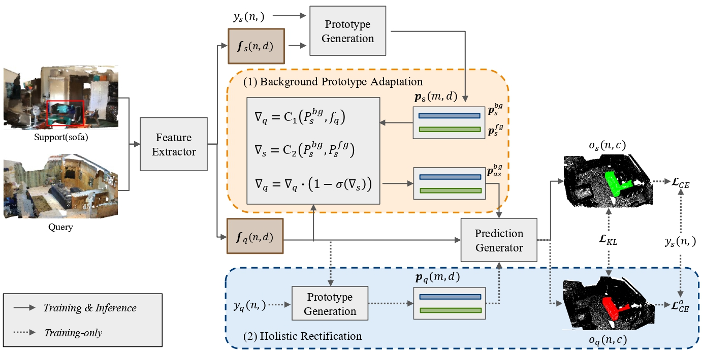

# Boosting Few-shot 3D Point Cloud Segmentation via Query-Guided Enhancement
Created by <a href="https://github.com/AaronNZH" target="_blank">Zhenhua Ning</a> from 
<a href="https://www.hitsz.edu.cn/index.html" target="_blank">Harbin Institute of Technology, ShenZhen</a>



## Installation
This repo is tested with Ubuntu 18.04
- Install `python` --This repo is tested with `python 3.10`.
- Install `pytorch` with CUDA -- This repo is tested with `torch 1.13.1`, `CUDA 11.7`. 
It may work with newer versions, but that is not guaranteed.
	```
	conda install pytorch==1.13.1 pytorch-cuda=11.7 -c pytorch -c nvidia
	```
- Install dependencies
    ```
    pip install -r requirements.txt
    ```

## Usage
```
cd Boosting-Few-shot-3D-Point-Cloud-Segmentation-via-Query-Guided-Enhancement
```
### Data preparation
#### S3DIS
1. Download [S3DIS Dataset Version 1.2](http://buildingparser.stanford.edu/dataset.html).
2. Re-organize raw data into `npy` files by running
   ```
   python ./preprocess/collect_s3dis_data.py --data_path $path_to_S3DIS_raw_data
   ```
   The generated numpy files are stored in `./datasets/S3DIS/scenes/data` by default.
3. To split rooms into blocks, run 

    ```python ./preprocess/room2blocks.py --data_path ./datasets/S3DIS/```
    
    One folder named `blocks_bs1_s1` will be generated under `./datasets/S3DIS/` by default. 


#### ScanNet
1. Download [ScanNet V2](http://www.scan-net.org/).
2. Re-organize raw data into `npy` files by running
	```
	python ./preprocess/collect_scannet_data.py --data_path $path_to_ScanNet_raw_data
	```
   The generated numpy files are stored in `./datasets/ScanNet/scenes/data` by default.
3. To split rooms into blocks, run 

    ```python ./preprocess/room2blocks.py --data_path ./datasets/ScanNet/ --dataset scannet```
    
    One folder named `blocks_bs1_s1` will be generated under `./datasets/ScanNet/` by default. 


### Running 
#### Training
First, pretrain the segmentor which includes the feature extractor module on the available training set:
    
    bash ./scripts/pretrain_segmentor.sh

Second, train our method:
	
	bash ./scripts/train_attMPTI.sh


#### Evaluation
    
    bash ./scripts/eval_attMPTI.sh

Note that the above scripts are used under 1-way 1-shot S<sup>0</sup> setting on S3DIS. You can modify the corresponding hyperparameters to conduct experiments in other settings. 


## Citation
Please cite our paper if it is helpful to your research:


## Acknowledgement
We thank [DGCNN (pytorch)](https://github.com/WangYueFt/dgcnn/tree/master/pytorch) and [AttMPTI](https://github.com/Na-Z/attMPTI) for sharing their source code.
